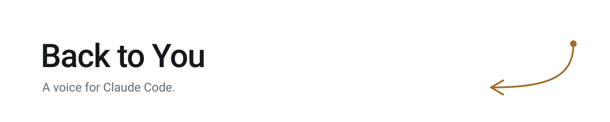

<p align="center">
  <picture>
    <source media="(prefers-color-scheme: dark)" srcset="assets/banner-dark.svg">
    
  </picture>
</p>

# Back to You — voices by elevenlabs.io

A voice for Claude Code.

_"Back to you."_

> You kick off a refactor, switch to your browser, and forget the terminal exists.
> Ten minutes later Claude has been waiting on a yes/no the whole time.

Back to You gives [Claude Code](https://code.claude.com/docs) a quiet voice. It says "Done." when a task finishes and "Your call." when it needs a decision — short, flat, never enthusiastic, like a competent engineer sitting beside you. Every clip is original audio made for this, not game sounds borrowed from elsewhere.

<p align="center">
  
</p>

<!--
  AUDIO — paste the bare https://github.com/user-attachments/assets/<uuid> URL
  on its own line, directly below, and GitHub renders an inline player.
  Mint it by dragging sounds/claude/task-complete/vo-back-to-you.mp3 into any
  GitHub comment box.
-->

## What you hear

Each pack ships one clip per hook today.

| When it plays | What you hear |
| --- | --- |
| **A task finishes** | _"Back to you."_ |
| **Claude needs a decision** | _"Waiting on you."_ |
| **A turn fails** | _"Hit an error."_ |
| **A subagent finishes** | _"Subagent's done."_ — a near-whisper, meant to be barely noticed |

The first row plays at the end of **every** response. That is the point, and it is also the thing to know before installing: the clips are kept under a second and a half for exactly this reason.

Want more variety? Drop extra `.mp3` or `.wav` files into any `sounds/<pack>/<category>/` folder — the hook picks one at random each time it fires, so add as many takes as you like.

## Voice packs

Four packs ship today. The installer asks which to activate; switching later is a one-line edit to `sound-theme.txt`, no reinstall needed.

| Pack | Vibe |
| --- | --- |
| `claude` _(default)_ | Calm, dry, competent-engineer-beside-you. Understated humor, never enthusiastic. |
| `gigatron` | A genius AI quietly amused by humans — deep, wry, faintly metallic, calm menace under the humor. |
| `jay-run` | A second neutral voice, no character write-up yet — give it a listen. |
| `mistress-of-pain` | Low, smoky, predatory calm — an amused, coldly curious hunter, not a seductress. |

Want your own? See "Make your own theme" below.

## Install

### macOS

```bash
git clone https://github.com/jasonrundell/back-to-you.git
cd back-to-you
./install.sh
```

You'll be asked to pick a voice pack — `claude`, `gigatron`, `jay-run`, or `mistress-of-pain` — with `claude` as the default if you just press Enter. Restart Claude Code. That's it.

Needs nothing beyond a stock macOS — no Homebrew, no `jq`, no Python, no Node.

<details>
<summary>Prefer a download to a clone?</summary>

Grab the zip from [Releases](https://github.com/jasonrundell/back-to-you/releases), unzip it, then double-click `install.command`.

macOS quarantines anything downloaded through a browser, so you may see `Operation not permitted`. To clear it, open Terminal, type `xattr -d -r com.apple.quarantine ` (with the trailing space), then drag the unzipped folder into the Terminal window and press Return. Run the installer again.

Cloning avoids this entirely — `git` doesn't set the quarantine flag. That's why it's the headline path.

</details>

### Windows

1. Download the zip from [Releases](https://github.com/jasonrundell/back-to-you/releases)
2. Right-click it and choose **Extract All**
3. Open the extracted folder and double-click **`install.bat`**
4. Pick a voice pack when prompted — `claude`, `gigatron`, `jay-run`, or `mistress-of-pain` — or press Enter for `claude`
5. Restart Claude Code

Uses PowerShell, which is already on your PC. Nothing else to install.

<details>
<summary>If Windows shows a blue warning screen</summary>

"Windows protected your PC" appears for any script that didn't come from the Microsoft Store. Click **More info**, then **Run anyway**. Nothing is being installed system-wide — the installer only writes into your own `.claude` folder.

</details>

## Platform support

Both desktop platforms work with nothing extra to install.

| Platform | Works today | How it plays sound |
| --- | :---: | --- |
| **Windows 10/11** | Yes | PowerShell, built in |
| **macOS** | Yes — new, lightly tested | `afplay`, built in |
| **Linux** | Not yet | Would need `paplay` / `aplay` — PRs welcome |

macOS support is new and hasn't been through many hands yet. If something breaks, [open an issue](https://github.com/jasonrundell/back-to-you/issues) — it's the fastest way to get it fixed.

Also works with **Cowork**, which reads the same hooks.

## FAQ

**Why don't I hear sounds in a cloud session (Claude Code on the web, or a cloud session opened through the desktop app)?**

Hooks run wherever the session itself runs. A local `claude` CLI session runs on your machine, so `afplay` (or PowerShell) can reach your speakers. A cloud session runs inside an isolated remote container instead, with no path to your local audio hardware — the hook command genuinely executes, it just has nothing to play through. Cloud sessions also only load hooks from repository-level (`.claude/settings.json`) and organization-managed settings, not your machine's `~/.claude/settings.json`, so the entries this installer wires wouldn't even be read there.

There's no supported way today to make a cloud session play sound on your local machine — that would need a client-side hook or notification callback from Claude Code itself, which is outside what this repo's scripts can do. If you rely on audio feedback, run Claude Code locally.

## Turning it off

**One sound too many?** Delete the clips from that folder and it stops. The hooks exit quietly when a folder is empty — no settings to edit, no reinstall.

```
~/.claude/sounds/claude/error/          ← delete these, no more error sounds
```

**All of it?** Delete the installed files and remove the `Back to You` entries from `~/.claude/settings.json`:

```
~/.claude/hooks/play-sound.sh      (or .ps1 on Windows)
~/.claude/hooks/play-category.sh   (or .ps1 on Windows)
~/.claude/sounds/
~/.claude/sound-theme.txt
```

Installed before v1? Older builds also left `~/.claude/hooks/play-sound-decision.sh` (or `.ps1`) behind. Running the current installer unwires it for you; the file itself is inert once unwired, and safe to delete.

<details>
<summary><h2 style="display:inline">How it works</h2></summary>

Claude Code [hooks](https://code.claude.com/docs/en/hooks) let you run a command when something happens. This installs two scripts and points five events at them.

```
Stop ──────────→ 🔊 "That's finished."
Notification ──→ 🔊 "Your call."
```

| Event | When it fires | What you hear |
| --- | --- | --- |
| `Stop` | A response ends | `task-complete`, or `decision-needed` if the response ends in a question |
| `Notification` | Claude asks for permission or input | `decision-needed` |
| `PreToolUse` | Claude opens the multiple-choice picker | `decision-needed` |
| `SubagentStop` | A subagent finishes | `subagent-done` |
| `StopFailure` | A turn ends on an API error | `error` |

`Notification` is matched to the types that are genuinely a request for input, and `PreToolUse` to `AskUserQuestion` — the picker has no notification type of its own, and would otherwise be the one decision-shaped moment that stays silent. `PostToolUseFailure` is deliberately left alone: it fires on every failed tool call, including a `grep` that finds nothing, and would buzz constantly.

**`SubagentStop` and `Stop` can fire moments apart.** When a subagent is the last thing a turn does, you'd otherwise hear the subagent-done clip and then task-complete right after it — two "done" sounds for one finished task. The `Stop` hook checks for that and skips its own clip when it fires immediately after a subagent-done one. A real question still gets its decision-needed clip either way.

**`SessionStart` is deliberately not wired**, and there is no startup greeting. Earlier versions wired it, matched to `startup` so it wouldn't replay on `/clear` or after a compaction. That wasn't enough: `startup` means every new *session*, not every app launch, and short-lived sessions are common. Measured over a six-hour run it fired about four times an hour and accounted for **69% of every sound heard**, in bursts as tight as four in 43 seconds. It was also the least useful of the set — a session starting is the one moment you're already looking at the terminal, which is exactly what `task-complete` and `decision-needed` are for. Reinstalling removes the hook from an existing install.

The installer merges these into `~/.claude/settings.json` without touching anything else in it, backing the file up first:

```json
{
  "hooks": {
    "Stop": [
      { "hooks": [ { "type": "command", "command": "\"~/.claude/hooks/play-sound.sh\"", "timeout": 10 } ] }
    ]
  }
}
```

**On latency.** The `Stop` hook waits for the clip to finish before the turn closes, so every clip is a small tax on every response. That's why they're all under about a second and a half, and why there's a six-second hard cap. If you add your own, keep them short.

</details>

<details>
<summary><h2 style="display:inline">Make your own theme</h2></summary>

A theme is a folder of sounds. Create `sounds/<name>/` with these subfolders, drop in `.mp3` or `.wav` files, and install it:

```
sounds/mytheme/
├── task-complete/
├── decision-needed/
├── error/
└── subagent-done/
```

```bash
./install.sh mytheme      # macOS
install.bat mytheme       # Windows
```

Naming a theme on the command line skips the interactive picker — handy for scripting. Leave it off and `mytheme` shows up as a numbered choice alongside the built-in packs.

Every theme on disk gets installed; the active one is named in `~/.claude/sound-theme.txt`. Edit that one line to switch — it takes effect on the next sound, with no reinstall and no restart.

**Keep `task-complete` clips under about 1.5 seconds.** That folder plays at the end of every response, and anything longer starts to feel like lag.

Themes are for your own machine. This repository ships only audio it made itself, so theme contributions aren't accepted — see below for why that matters.

</details>

## License

Two licenses, and the difference matters:

- **Code, scripts, docs, artwork** — MIT. See [LICENSE](LICENSE).
- **Audio under `sounds/`** — **not open source.** See [LICENSE-AUDIO](LICENSE-AUDIO). Redistributable and modifiable, but non-commercial only, with ElevenLabs attribution preserved and no AI training.

That split isn't a preference. The clips were generated with ElevenLabs, whose terms forbid offering their output under anything more permissive — which rules out MIT and every Creative Commons license alike.

**If those terms don't suit you, generate your own.** [ELEVENLABS-VOICE-PROMPT.md](ELEVENLABS-VOICE-PROMPT.md) is MIT and holds the complete recipe: the voice design prompt, the model settings, and the exact line for each of the four clips. Run it under your own ElevenLabs account and the audio is yours outright.

## About the sounds

Every clip here is original. The voice was designed for this project and generated with [ElevenLabs](https://elevenlabs.io) — no game audio, no rights-holder problem, no disclaimer needed.

---

Not affiliated with Anthropic. "Claude" and "Claude Code" are their trademarks, used here only to say what this works with.
